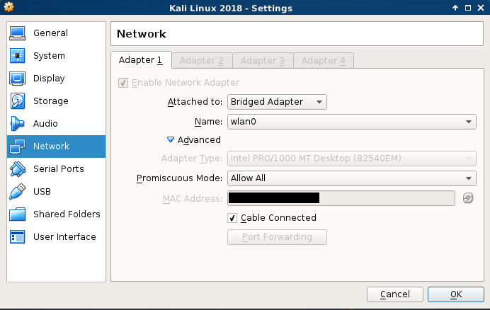
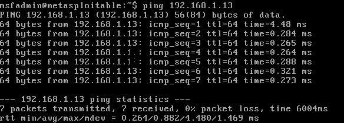
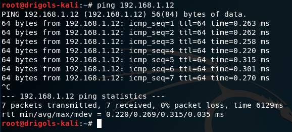
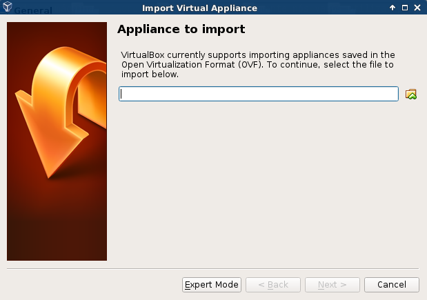
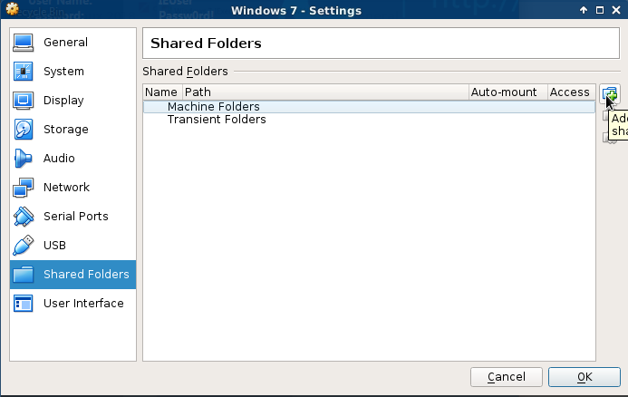
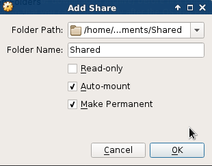
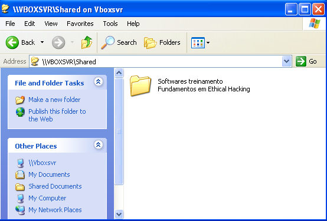

# Preparação do ambiente de testes  
  
 - [Baixando o VirtualBox](#baixando-o-virtualbox)  
 - [Baixando o Kali Linux](#baixando-o-kali-linux)  
 - [Kali Linux - Como começou?](#inicio-do-kali-linux)  
 - [Configuração do Kali Linux](#configuração-do-kali-linux)  
 - [Baixando o Metasploitable](#baixando-o-metasploitable)  
 - [Testando a comunicação entre Kali Linux e o Metasploitable](#testando-a-comunicação-entre-kali-linux-e-o-metasploitable)  
 - [Privilégios root no Metasploitable](#privilégios-root-no-metasploitable)  
 - [OSBoxes](#osboxes)  
 - [Instalação das máquinas Windows](#instalação-das-máquinas-windows)  
 - [VBox Additions](#vbox-additions)  
 - [Instalando Softwares Vulneráveis](#instalando-softwares-vulneráveis)  
 - [Tips](#tips)  
  
## Baixando o VirtualBox  
  
Bem, vamos iniciar nosso ambiente baixando o __VirtualBox__ que é um ambientes para instalação de sistemas distintos. Ele permite a instalação e utilização de um sistema operacional dentro de outro, assim como seus respectivos softwares, como dois ou mais computadores independentes, mas compartilhando fisicamente o mesmo hardware.  
  
__SITE OFICIAL:__  
  
> https://www.virtualbox.org/  
  
## Baixando o Kali Linux  
  
Agora vamos baixar o __Kali Linux__ que é um Sistema Operacional Linux baseado no Debian, que é desenvolvido pela pequena e consagrada equipe da __Offensive Security__. Ele contem mais de 300 ferramentas nativas para:  
  
 - Testes de invasão  
 - Penetração  
 - Força bruta  
 - Forense, entre outras.  
  
Atualmente é um dos sistemas mais famosos no mundo na área de e __Segurança da informação__. Muito utilizado por hackers, pentesters, analistas e auditores de segurança da informação. O site oficial para baixar o Sistema Operacional é o seguinte:  
  
> https://www.kali.org/  
  
## Inicio do Kali Linux  
  
O __Kali Linux__ chegou para ficar no lugar do descontinuado <u>BackTrack</u>, Sistema Operacional Linux baseado no Ubuntu, lançado em 2006, com o mesmo objetivo de construção. Podemos considerar que o <u>BackTrack</u> apenas mudou de “nome” para __Kali Linux__, que é uma versão melhorada do antigo sistema favorito dos hackers e auditores de segurança.  
  
## Configuração do Kali Linux  
  
Bem, essa vai ser uma introdução de configuração do Kali Linux, ou seja, nada de muito profundo vai ser discutido nesta parte.  
  
É normal em alguns sistemas de testes de segurança as senhas sejam sempre:  
  
```  
Username: root  
Password: toor  
```  
  
Essa senha também era utilizada no <u>BackTrack</u>, não é nada padrão mas era um costume (que deve ser mudado não acham?). Se vocês prestarem atenção a senha é o login ao contrário.  
  
Uma coisa que nós devemos lembrar é de colocar a nossa placa de rede em __Bridged Adapter__.  
  
  
  
No momento eu estou em uma rede __wireles (sem fio)__ por isso selecionei a opção __"wlan"__.  
  
Agora é interessante atualizar os repositórios disponíveis. Para isso vamos utilizar o comando:  
  
```  
# apt-get update  
```  
  
Se você desejar (eu recomendo) atualizar os softwares que tem referências salvas nos repositórios é só atualizar esses com o seguinte comando:  
  
```  
# apt-get upgrade  
```  
  
__NOTE:__  
Se por algum acaso sair alguma distribuição nova do __Kali Linux__ e você quiser atualizar sem perde suas configurações você pode utilizar o seguinte comando:  
  
```  
# apt-get dist-upgrade  
```  
  
> Eu não recomendo essa prática porque existem alguns efeito indesejáveis. Vocês podem pesquisar antes para não apagarem algo que seja importante.  
  
## Baixando o Metasploitable  
  
O __Metasploitable__ é uma Máquina Virtual rodando Ubuntu Server 8.04, com diversos softwares em versões com <u>vulnerabilidades conhecidas</u>, tais como __Tomcat__, __TikiWiki__, entre outros.  
  
O objetivo é estudar a execução de alguns testes e auditorias, assim como a utilização de exploits conhecidos com facilidade em versões antigas de softwares. Ou seja, é uma ótima ferramente para quem está começando aprender os conceitos iniciais.  
  
> https://sourceforge.net/projects/metasploitable/  
  
O __login__ e __senha__ para essa máquina vem por padrão a seguinte:  
  
```  
Username: msfadmin  
Password: msfadmin  
```  
  
> The default login and password is msfadmin:msfadmin.  
  
## Testando a comunicação entre Kali Linux e o Metasploitable  
  
É interessante agora nós testarmos a comunicação entre às máquinas __Kali Linux__ e __Metasploitable__. Para isso vamos utilizar o prótocolo __ICMP (Internet Control Message Protocol)__ da camada de __Rede__ do módelo <u>OSI</u> para verificar essa comunicação.  
  
Para isso vamos utilizar o comando __ifconfig__ para ver a rede que as máquinas estão conectadas e seus endereços IP:  
  
```  
# ifconfig  
```  
  
Os endereços IPs das minhas máquinas (Os seus podem ser diferentes dependendo da rede) foram os seguintes:  
  
```  
Metasploitable: 192.168.1.13  
Kali Linux: 192.168.1.13  
```  
  
Agora é muito simples, basta utilizar o comando __ping (que utilizar o protocolo ICMP)__ para fazer uma máquina pingar na outra.  
  
__Metasploitable pingando no Kali Linux:__  
  
  
__Kali Linux pingando no Metasploitable:__  
  
  
## Privilégios root no Metasploitable  
  
Como vocês podem ter notado o Metasploitable não vem com __privilégios__ root igual o Kali Linux. Para fazer o __Metasploitable__ ficar como root basta rodar o seguinte comando:  
  
```  
# sudo su  
# password: msfadmin  
```  
  
Pronto, agora você tem os __privilégios__ de super usuário.  
  
## OSBoxes  

__OSBoxes__ é uma plataforma que disponibiliza várias máquinas virtuais <u>prontas</u>. Isso é bem interessante para quem está iniciando porque pode ser difícil encontrar máquinas antiga ou até mesmo algumas mais recente. Outra coisa interessante é que essas máquinas existem para __VirtualBox__ e __VMware__.  
  
__SITE OFICIAL:__  
  
> https://www.osboxes.org/  
  
Agora baixe a máquina __Android 4.4 r4__ que futuramente nós vamos utilizar para fazer alguns testes.  
  
__NOTE:__  
Quando você baixar e instalar a máquina __Android__ é possível que seu mouse trave dentro da máquina. Para sair basta utilizar a tecla hospedeiro que ele vai exibir. Essa tecla é sempre __Ctrl__ ou __Alt__, porém as que dicam do lado __direito__.  
  
Eu não vou deixar links (até porque o Windows é um software proprietário), mas agora só falta você baixar o __Windows XP__ e __Windows 7__.  
  
## Instalação das máquinas Windows  
  
Existe uma maneira de instalação de diferente para máquinas prontas. Com o seu VirtualBox aberto, basta ir em __file/Import Appliance..__ e importar a Máquina Virtual do Windows.  
  
  
  
Depois que você passar a __VM__ vai aparecer algumas opções que você poderá modificar se assim desejar e espera o processo para a sua máquina ficar pronta.  
  
## VBox Additions  
  
Agora que já temos as Máquinas Virtuais Windows instaladas, precisamos instalar os __Additions__ mas recentes. Para isso vá em cada máquina em __"Devies/Insert Guest Additions CD Images..."__ e fazer o procedimento de instalação.  
  
# Instalando Softwares Vulneráveis  
  
Bem, agora chegou a hora de instalar os Software Vulneráveis que serão utilizados para testes. Primeiro vá na sua máquina em __"Devices/Shared Folders/Shared Folders Settings..."__:  
  
  
  
Na imagem acima selecione __Machine Folders__ e clique no __"+"__:  
  
  
  
Pronto, agora você vai selecionar qual o folder que vai ficar compartilhado com a sua com a sua __MV__ e marca as opções que foram selecionadas na imagem acima:  
  
 - Auto-mount  
 - Make permanent  
  
Agora como acessa esse folder(diretório) que foi compartilhado a partir da __MV__? Simples, basta ir na barrinha de pesquisa do Windows e digitar:  
  
```  
\\vboxsvr  
```  
  
Pronto, agora você pode abrir um diretório que vai dá acesso a pasta compartilhada da sua máquina real. Agora é só copiar esses arquivos para a sua Máquina Virtual e instalar.  
  
  
  
## Tips  
  
Não esqueça de sempre que instalar as Máquinas Virtuais modificar a rede para __Bridge Adapter__ e ir em __System/Processor__ e habilitar o checkbox __Enable PAE/NX__.  
  
Outra dica interessante é você desativar o __Firewall__ de início e se por um acaso for necessário você ativa para testar como __burlar Firewall__.  
  
<strong>Rodrigo Leite - Software Engineer</strong>